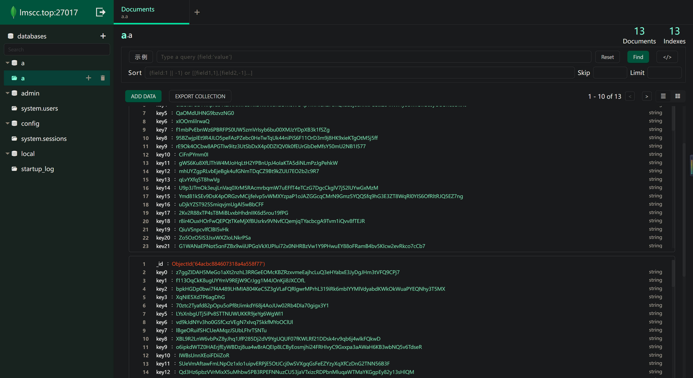

### mongodb图形界面
`react` `redux` `react-router` `ant-design`  
[online](https://lmscc.top/mongodbui/)

**简介**：  
使用vite构建的，仿造mongodb compass的数据库图形界面，实现对数据库，集合，文档的增删改查

**技术栈**：
- 前端：react redux react-router antd axios stylus
- 后端：nodejs express mongodb 

**主要工作**:
- 实现了web端和服务器通信，服务器通过ip地址端口连接mongodb数据库
- 数据库的增删，集合的增删，文档的条件查询及增删改
- 封装文档编辑组件，实现快速增加数组、对象、字符串等文档属性,实现对文档的增删改操作
- 通过虚拟滚动渲染树形组件，防止大数据量造成页面卡死
- 通过脚本调用babel自动生成http接口代码，前端请求代码
  
**运行**  
服务器 server下 npm run dev
客户端 client下 npm run dev

